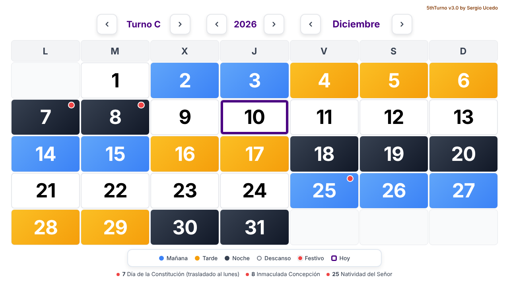
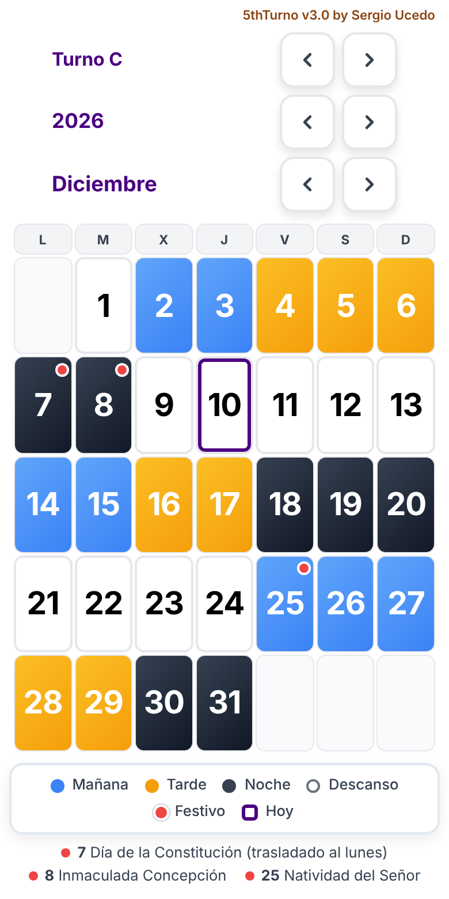

# 5thTurno · Calendario de turnos rotativos

**Español** · [English](README.en.md)

[](https://github.com/xerchion/5thTurno/actions/workflows/tests.yml)
[](LICENSE)

Calendario web para consultar qué turno le toca a cada uno de los cinco equipos (A–E) de una rotación 24/7: mañana, tarde, noche o descanso, con los festivos marcados.

**[Abrir el calendario →](https://xerchion.github.io/5thTurno/)**

| Escritorio | Móvil |
| --- | --- |
|  |  |

## Qué hace

- Muestra el mes completo de cualquier equipo, con un color por turno.
- Permite cambiar de equipo, de mes y de año con las flechas (de 2000 a 2099).
- Marca los festivos con un punto rojo sin tapar el turno, y los lista debajo del calendario.
- Destaca el día de hoy con un marco.
- Recuerda el equipo elegido entre visitas.
- Se adapta a la pantalla: el mes entero cabe sin desplazarse, en móvil y en escritorio.

Todo se calcula en el navegador. No hay servidor, base de datos ni cuentas, y no se envía ningún dato.

## Cómo funciona la rotación

Los cinco equipos siguen el mismo ciclo de 35 días, cada uno desplazado 7 días respecto al anterior:

```
MM TT NNN DDDD  |  MMM TT NN DDDDD  |  MM TTT NN DDDDD
```

`M` mañana · `T` tarde · `N` noche · `D` descanso

Son tres tandas de 7 días de trabajo seguidas de 4, 5 y 5 días de descanso. Con ese desfase, cada día hay exactamente un equipo de mañana, uno de tarde, uno de noche y dos descansando.

El turno de un equipo en una fecha se obtiene con una sola operación:

```
turno = CICLO[(desfase del equipo + días desde el 1-ene-2022) mod 35]
```

La explicación completa, con un ejemplo paso a paso, está en [docs/FUNCIONAMIENTO.md](docs/FUNCIONAMIENTO.md).

## Festivos

Se calculan para cada año:

- **Nacionales y de Andalucía:** diez de fecha fija más Jueves y Viernes Santo. Los que caen en domingo pasan al lunes.
- **Locales de Loja (Granada):** 25 de abril y 29 de agosto.

El calendario oficial se aprueba cada año, así que la regla puede necesitar un ajuste puntual. Las tablas `LOCALES_POR_AÑO` y `EXCEPCIONES_POR_AÑO` de [`js/festivos.js`](js/festivos.js) sirven para eso; el procedimiento está en la [documentación técnica](docs/FUNCIONAMIENTO.md#festivos).

## Usarlo en local

No hay nada que instalar ni compilar. Clona el repositorio y abre `index.html` en el navegador:

```bash
git clone https://github.com/xerchion/5thTurno.git
cd 5thTurno
```

Si prefieres servirlo por HTTP:

```bash
python -m http.server 8000
# http://localhost:8000
```

## Pruebas

La lógica de turnos y festivos tiene pruebas automáticas con el ejecutor incluido en Node.js (18 o superior), sin dependencias:

```bash
npm test
```

Comprueban, entre otras cosas, que cada día de 2000 a 2099 hay un equipo en cada turno y que los festivos de Andalucía de 2026 y 2027 coinciden con el calendario oficial.

## Estructura

```
index.html            Página y controles
css/styles.css        Estilos y adaptación a la pantalla
js/turnos.js          Rotación de turnos (lógica pura)
js/festivos.js        Festivos de cada año (lógica pura)
js/app.js             Interfaz: estado, pintado y navegación
tests/                Pruebas de turnos.js y festivos.js
docs/                 Documentación técnica y capturas
img/                  Icono e imagen para compartir el enlace
```

## Adaptarlo a otra rotación

| Para cambiar | Edita |
| --- | --- |
| La secuencia de turnos | `BLOQUES` en `js/turnos.js` |
| El punto de partida de cada equipo | `DESFASE` y la fecha de referencia en `js/turnos.js` |
| Los festivos autonómicos | `FIJOS` en `js/festivos.js` |
| El municipio y sus festivos locales | `MUNICIPIO`, `LOCALES_HABITUALES` y `LOCALES_POR_AÑO` en `js/festivos.js` |

Después de cualquier cambio, `npm test` indica si la rotación sigue cubriendo todos los turnos.

## Limitaciones

- La rotación se extiende hacia atrás y hacia delante desde el 1 de enero de 2022 sin cambios. Si el cuadrante real se modificó en algún momento, las fechas anteriores no lo reflejan.
- Los festivos de años futuros siguen la regla general; el decreto de cada año puede apartarse de ella.
- Los festivos locales de Loja se fijan año a año. Los de 2027 no estaban publicados al cerrar esta versión, y las fechas habituales caen en domingo ese año.

## Tecnología

HTML, CSS y JavaScript sin librerías ni proceso de compilación. La tipografía Inter se carga de Google Fonts, con las fuentes del sistema como alternativa. Publicado con GitHub Pages.

## Licencia

[MIT](LICENSE) © Sergio Ucedo · [Portfolio](https://xerchion.github.io/webPortfolio/)
