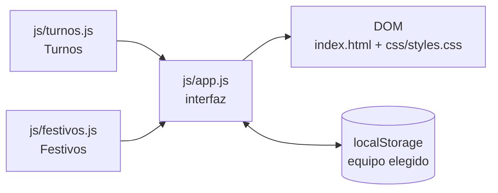

# Cómo funciona 5thTurno

[English version](HOW-IT-WORKS.md)

Documentación técnica de la versión 3.0. Explica el modelo de la rotación, el cálculo de festivos, la interfaz y las pruebas. Para un resumen de uso, ve al [README](../README.md).

## Índice

- [Arquitectura](#arquitectura)
- [La rotación de turnos](#la-rotación-de-turnos)
- [Festivos](#festivos)
- [Interfaz](#interfaz)
- [Referencia de módulos](#referencia-de-módulos)
- [Pruebas](#pruebas)
- [Decisiones de diseño](#decisiones-de-diseño)

## Arquitectura

La aplicación es una página estática con tres scripts clásicos (sin módulos ES ni compilación), cargados en este orden:



| Fichero | Responsabilidad | Toca el DOM |
| --- | --- | --- |
| `js/turnos.js` | Qué turno tiene un equipo en una fecha | No |
| `js/festivos.js` | Qué días son festivos en un año | No |
| `js/app.js` | Estado, pintado del mes, navegación y preferencias | Sí |

`turnos.js` y `festivos.js` definen cada uno un objeto global (`Turnos`, `Festivos`) y, si se cargan desde Node.js, lo exportan con `module.exports`. Por eso las pruebas ejecutan exactamente el mismo código que el navegador, y la página sigue funcionando al abrir `index.html` directamente desde el disco.

**Convención de fechas.** En todo el código los meses van de 0 (enero) a 11 (diciembre), como en `Date`. Las cuentas de días se hacen en UTC para que los cambios de hora no añadan ni quiten un día.

## La rotación de turnos

### El ciclo

`BLOQUES` describe el ciclo como pares `[turno, días]`:

| Tanda | Mañana | Tarde | Noche | Descanso | Total |
| --- | --- | --- | --- | --- | --- |
| 1 | 2 | 2 | 3 | 4 | 11 |
| 2 | 3 | 2 | 2 | 5 | 12 |
| 3 | 2 | 3 | 2 | 5 | 12 |
| **Ciclo** | **7** | **7** | **7** | **14** | **35** |

Desplegado día a día queda la constante `CICLO`, de 35 posiciones (0 a 34):

```
posición  0         1         2         3
          01234567890123456789012345678901234
turno     MMTTNNNDDDDMMMTTNNDDDDDMMTTTNNDDDDD
```

### El desfase de cada equipo

`DESFASE` indica en qué posición del ciclo estaba cada equipo el 1 de enero de 2022, la fecha de referencia:

| Equipo | E | C | A | D | B |
| --- | --- | --- | --- | --- | --- |
| Posición | 5 | 12 | 19 | 26 | 33 |

Las posiciones están separadas exactamente 7 días. De ahí salen tres propiedades:

1. **Cobertura completa.** Cada día hay un equipo de mañana, uno de tarde, uno de noche y dos de descanso.
2. **Relevo en cadena.** Cada equipo repite, una semana después, lo que hizo el anterior en la cadena B → D → A → C → E → B.
3. **Días de la semana fijos.** Como 35 días son 5 semanas justas, las tandas de trabajo empiezan siempre en lunes, viernes y miércoles, para todos los equipos.

### La fórmula

```js
posición = DESFASE[equipo] + díasDesdeReferencia(fecha)
turno    = CICLO[posición mod 35]
```

`díasDesdeReferencia` es negativo para fechas anteriores a 2022, así que el resto se calcula con un módulo que siempre devuelve un valor entre 0 y 34. La rotación continúa hacia atrás sin saltos.

**Ejemplo.** Equipo C, 12 de octubre de 2026:

- Del 1 de enero de 2022 al 12 de octubre de 2026 hay 1.745 días.
- Posición: 12 + 1.745 = 1.757.
- 1.757 mod 35 = 7.
- `CICLO[7]` es `D`: el equipo C descansa.

## Festivos

`Festivos.festivosDelAño(año)` construye el calendario de un año y lo guarda en caché. El resultado es un `Map` de `"mes-día"` a nombre del festivo.

### Regla general

1. **Diez festivos de fecha fija** (`FIJOS`): 1 y 6 de enero, 28 de febrero, 1 de mayo, 15 de agosto, 12 de octubre, 1 de noviembre, 6, 8 y 25 de diciembre.
2. **Traslado.** Si uno de ellos cae en domingo, pasa al lunes siguiente y el nombre lo indica: `Todos los Santos (trasladado al lunes)`.
3. **Semana Santa.** Jueves y Viernes Santo, tres y dos días antes del domingo de Pascua. La Pascua se obtiene con el algoritmo gregoriano de Meeus/Jones/Butcher (`domingoDePascua`).
4. **Festivos locales** del municipio (`LOCALES_HABITUALES`): en Loja, 25 de abril y 29 de agosto. No se trasladan.

Si dos festivos coinciden en el mismo día, los nombres se unen con ` / `.

### Contraste con el calendario oficial

La regla reproduce los doce festivos publicados por la Junta de Andalucía:

| Año | Norma | Traslados que recoge |
| --- | --- | --- |
| 2026 | Decreto 101/2025 | Todos los Santos al 2-nov, Constitución al 7-dic |
| 2027 | Decreto 84/2026 | Día de Andalucía al 1-mar, Asunción al 16-ago |

Las dos listas están en `tests/festivos.test.js`. Las fechas locales de Loja coinciden con las publicadas para 2023 y 2026.

### Actualizar un año

El calendario se aprueba cada año y puede apartarse de la regla. Hay dos tablas para corregirlo sin tocar el resto del código, ambas en `js/festivos.js`.

**Festivos locales distintos de los habituales** (el caso más frecuente):

```js
const LOCALES_POR_AÑO = Object.freeze({
    // Fechas de ejemplo: sustitúyelas por las publicadas en el BOJA.
    2027: [
        [3, 26, 'San Marcos (fiesta local de Loja)'],
        [7, 30, 'Fiesta local de Loja'],
    ],
});
```

**Un año completo que no sigue la regla:** añade la lista entera de festivos nacionales y autonómicos a `EXCEPCIONES_POR_AÑO`, con el mismo formato `[mes, día, nombre]`. Los locales se siguen tomando de las tablas anteriores.

El nombre de cada festivo local debe incluir el del municipio (`MUNICIPIO`); las pruebas lo usan para distinguirlos de los autonómicos.

## Interfaz

### Estado

`app.js` mantiene un único objeto:

```js
estado = { equipo: 'C', año: 2026, mes: 9 }
```

Al cargar, el año y el mes son los actuales y el equipo es el último elegido (guardado en `localStorage` con la clave `5thturno.equipo`) o `C` si no hay ninguno. Si el almacenamiento no está disponible, la página funciona igual y simplemente no recuerda el equipo.

### Pintado

Cada cambio de estado llama a `pintar()`, que reconstruye la rejilla del mes:

1. Actualiza los tres títulos y desactiva las flechas en los límites (2000 y 2099).
2. Crea las siete cabeceras de día de la semana.
3. Añade huecos hasta el primer día del mes (la semana empieza en lunes).
4. Crea una celda por día con la clase de su turno (`morning`, `afternoon`, `night`, `dayoff`), y `holiday` o `today` si corresponde.
5. Completa la última semana con huecos.
6. Sustituye el contenido de la rejilla de una vez y escribe la lista de festivos del mes.

Un mes ocupa cuatro, cinco o seis semanas; las filas se reparten el alto disponible.

Cuando la pestaña vuelve a estar visible se repinta, para que la marca de hoy sea correcta si la página se quedó abierta de un día para otro.

### Accesibilidad

- Los botones de flecha tienen nombre (`aria-label`) y estado desactivado real.
- Cada día incluye un texto para lectores de pantalla con la fecha completa, el turno y, si procede, el festivo: «lunes, 12 de octubre de 2026: Descanso. Festivo: Fiesta Nacional de España.»
- El día de hoy lleva `aria-current="date"`.
- Los títulos de turno, año y mes anuncian sus cambios (`aria-live`).
- Las animaciones se desactivan con `prefers-reduced-motion`.

### Adaptación a la pantalla

La página tiene el alto de la ventana (`100dvh`) y la rejilla ocupa el espacio que dejan los controles y la leyenda. El tamaño de los números se calcula con unidades de contenedor (`cqw`, `cqh`), de modo que el mes completo cabe sin desplazarse. Hay dos puntos de corte:

| Ancho | Disposición de los controles |
| --- | --- |
| Menos de 900 px | Tres filas: título a la izquierda, flechas a la derecha |
| 900 px o más | Una fila: flecha, título, flecha |

En pantallas muy bajas, como un móvil apaisado, la página tiene una altura mínima y se desplaza.

## Referencia de módulos

### `Turnos`

| Miembro | Descripción |
| --- | --- |
| `EQUIPOS` | `['A', 'B', 'C', 'D', 'E']` |
| `NOMBRES_TURNO` | `{ M: 'Mañana', T: 'Tarde', N: 'Noche', D: 'Descanso' }` |
| `BLOQUES` | El ciclo como pares `[turno, días]` |
| `CICLO` | El ciclo desplegado: 35 letras |
| `DESFASE` | Posición de cada equipo el 1-ene-2022 |
| `AÑO_REFERENCIA` | `2022` |
| `diasDesdeReferencia(año, mes, dia)` | Días desde el 1-ene-2022; negativo si es anterior |
| `diasDelMes(año, mes)` | 28 a 31 |
| `turnoDe(equipo, año, mes, dia)` | `'M'`, `'T'`, `'N'` o `'D'`. Lanza `RangeError` si el equipo no existe |
| `turnosDelMes(equipo, año, mes)` | Array con el turno de cada día (posición 0 = día 1) |
| `equipoVecino(equipo, paso)` | Equipo siguiente (`1`) o anterior (`-1`), circular |

### `Festivos`

| Miembro | Descripción |
| --- | --- |
| `MUNICIPIO` | `'Loja'` |
| `FIJOS` | Festivos de fecha fija: `[mes, día, nombre]` |
| `LOCALES_HABITUALES` | Festivos locales por defecto |
| `LOCALES_POR_AÑO` | Festivos locales de años concretos |
| `EXCEPCIONES_POR_AÑO` | Calendario completo de años que no siguen la regla |
| `domingoDePascua(año)` | `{ mes, dia }` |
| `festivosDelAño(año)` | `Map` de `"mes-día"` a nombre |
| `festivoDe(año, mes, dia)` | Nombre del festivo o `null` |
| `festivosDelMes(año, mes)` | `[{ dia, nombre }]` ordenado por día |

## Pruebas

```bash
npm test
```

Usa `node --test`, incluido en Node.js 18 o superior. Son 19 pruebas en dos ficheros:

| Fichero | Qué comprueba |
| --- | --- |
| `tests/turnos.test.js` | Forma del ciclo; separación de 7 días entre equipos; un equipo por turno cada día de 2000 a 2099; mismos resultados que el algoritmo de la v2.6 de 2022 a 2040; continuidad antes de 2022; periodicidad de 35 días; valores conocidos |
| `tests/festivos.test.js` | Fechas de Pascua conocidas; calendarios oficiales de Andalucía de 2026 y 2027; traslado de domingo a lunes; ningún festivo autonómico en domingo; doce festivos autonómicos cada año; festivos locales |

El flujo de GitHub Actions (`.github/workflows/tests.yml`) las ejecuta en cada push a `main` y en cada pull request.

## Decisiones de diseño

- **Sin compilación ni dependencias.** El proyecto son ficheros que el navegador entiende tal cual; se despliega copiándolos.
- **Scripts clásicos en lugar de módulos ES.** Los módulos no cargan al abrir la página desde `file://`; con scripts clásicos funciona en local sin servidor.
- **Aritmética modular en lugar de tablas.** La v2.6 generaba un array de 400.000 elementos y lo recorría desde 2022. La fórmula actual no guarda nada y vale para cualquier fecha.
- **El festivo no sustituye al turno.** Quien trabaja a turnos necesita saber qué le toca también en festivo, así que el festivo es una marca sobre el color del turno.
- **Regla más tablas de excepción para los festivos.** La regla evita mantener una lista por año; las tablas permiten corregir un año concreto cuando el calendario oficial difiere.
