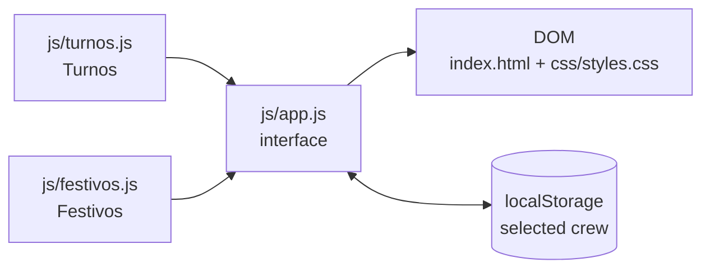

# How 5thTurno works

[Versión en español](FUNCIONAMIENTO.md)

Technical documentation for version 3.0. It covers the rotation model, the holiday calculation, the interface and the tests. For a usage overview, see the [README](../README.en.md).

Identifiers in the code are in Spanish, so they appear here untranslated. A short glossary: *turno* = shift, *equipo* = crew, *festivo* = public holiday, *año / mes / día* = year / month / day, *desfase* = offset, *ciclo* = cycle.

## Contents

- [Architecture](#architecture)
- [The shift rotation](#the-shift-rotation)
- [Public holidays](#public-holidays)
- [Interface](#interface)
- [Module reference](#module-reference)
- [Tests](#tests)
- [Design decisions](#design-decisions)

## Architecture

The application is a static page with three classic scripts (no ES modules, no build step), loaded in this order:



| File | Responsibility | Touches the DOM |
| --- | --- | --- |
| `js/turnos.js` | Which shift a crew works on a date | No |
| `js/festivos.js` | Which days are public holidays in a year | No |
| `js/app.js` | State, month rendering, navigation and preferences | Yes |

`turnos.js` and `festivos.js` each define a global object (`Turnos`, `Festivos`) and, when loaded from Node.js, export it through `module.exports`. The tests therefore run exactly the same code as the browser, and the page still works when `index.html` is opened straight from disk.

**Date convention.** Months run from 0 (January) to 11 (December) throughout the code, as in `Date`. Day counts are done in UTC so that daylight-saving changes never add or drop a day.

## The shift rotation

### The cycle

`BLOQUES` describes the cycle as `[shift, days]` pairs:

| Run | Morning | Afternoon | Night | Rest | Total |
| --- | --- | --- | --- | --- | --- |
| 1 | 2 | 2 | 3 | 4 | 11 |
| 2 | 3 | 2 | 2 | 5 | 12 |
| 3 | 2 | 3 | 2 | 5 | 12 |
| **Cycle** | **7** | **7** | **7** | **14** | **35** |

Expanded day by day it becomes the `CICLO` constant, with 35 positions (0 to 34):

```
position  0         1         2         3
          01234567890123456789012345678901234
shift     MMTTNNNDDDDMMMTTNNDDDDDMMTTTNNDDDDD
```

`M` = morning, `T` = afternoon, `N` = night, `D` = rest.

### Each crew's offset

`DESFASE` gives the position in the cycle each crew was at on 1 January 2022, the reference date:

| Crew | E | C | A | D | B |
| --- | --- | --- | --- | --- | --- |
| Position | 5 | 12 | 19 | 26 | 33 |

The positions are exactly 7 days apart. Three properties follow:

1. **Full coverage.** Every day has one crew on mornings, one on afternoons, one on nights and two resting.
2. **Chained handover.** Each crew repeats, one week later, what the previous crew did, in the chain B → D → A → C → E → B.
3. **Fixed weekdays.** Because 35 days is exactly 5 weeks, working runs always start on Monday, Friday and Wednesday, for every crew.

### The formula

```js
position = DESFASE[crew] + daysSinceReference(date)
shift    = CICLO[position mod 35]
```

`daysSinceReference` is negative for dates before 2022, so the remainder is computed with a modulo that always returns a value between 0 and 34. The rotation continues backwards without gaps.

**Example.** Crew C, 12 October 2026:

- From 1 January 2022 to 12 October 2026 there are 1,745 days.
- Position: 12 + 1,745 = 1,757.
- 1,757 mod 35 = 7.
- `CICLO[7]` is `D`: crew C is resting.

## Public holidays

`Festivos.festivosDelAño(year)` builds one year's calendar and caches it. The result is a `Map` from `"month-day"` to the holiday name.

### General rule

1. **Ten fixed-date holidays** (`FIJOS`): 1 and 6 January, 28 February, 1 May, 15 August, 12 October, 1 November, 6, 8 and 25 December.
2. **Transfer.** If one of them falls on a Sunday, it moves to the following Monday and the name says so: `Todos los Santos (trasladado al lunes)`.
3. **Holy Week.** Maundy Thursday and Good Friday, three and two days before Easter Sunday. Easter is computed with the Meeus/Jones/Butcher Gregorian algorithm (`domingoDePascua`).
4. **Local holidays** for the town (`LOCALES_HABITUALES`): in Loja, 25 April and 29 August. These are not transferred.

If two holidays land on the same day, their names are joined with ` / `.

### Checked against the official calendar

The rule reproduces the twelve holidays published by the regional government (Junta de Andalucía):

| Year | Decree | Transfers it captures |
| --- | --- | --- |
| 2026 | Decreto 101/2025 | All Saints to 2 Nov, Constitution Day to 7 Dec |
| 2027 | Decreto 84/2026 | Andalusia Day to 1 Mar, Assumption to 16 Aug |

Both lists are in `tests/festivos.test.js`. Loja's local dates match those published for 2023 and 2026.

### Updating a year

The calendar is approved every year and may depart from the rule. Two tables in `js/festivos.js` let you correct it without touching the rest of the code.

**Local holidays that differ from the usual ones** (the most common case):

```js
const LOCALES_POR_AÑO = Object.freeze({
    // Example dates: replace them with those published in the official gazette (BOJA).
    2027: [
        [3, 26, 'San Marcos (fiesta local de Loja)'],
        [7, 30, 'Fiesta local de Loja'],
    ],
});
```

**A whole year that does not follow the rule:** add the full list of national and regional holidays to `EXCEPCIONES_POR_AÑO`, in the same `[month, day, name]` format. Local holidays are still taken from the tables above.

Each local holiday's name must include the town name (`MUNICIPIO`); the tests use it to tell local holidays from regional ones.

## Interface

### State

`app.js` keeps a single object:

```js
estado = { equipo: 'C', año: 2026, mes: 9 }
```

On load, year and month are the current ones and the crew is the last one selected (stored in `localStorage` under the key `5thturno.equipo`), or `C` if there is none. If storage is unavailable the page works the same and simply does not remember the crew.

### Rendering

Every state change calls `pintar()`, which rebuilds the month grid:

1. Updates the three titles and disables the arrows at the limits (2000 and 2099).
2. Creates the seven weekday headers.
3. Adds blanks up to the first day of the month (weeks start on Monday).
4. Creates one cell per day with its shift class (`morning`, `afternoon`, `night`, `dayoff`), plus `holiday` or `today` where applicable.
5. Pads the last week with blanks.
6. Replaces the grid contents in one go and writes the month's holiday list.

A month takes four, five or six weeks; the rows share the available height.

When the tab becomes visible again the grid is repainted, so the today marker is right if the page was left open overnight.

### Accessibility

- Arrow buttons have a name (`aria-label`) and a real disabled state.
- Every day carries screen-reader text with the full date, the shift and, where relevant, the holiday.
- Today has `aria-current="date"`.
- The crew, year and month titles announce their changes (`aria-live`).
- Animations are disabled under `prefers-reduced-motion`.

### Fitting the screen

The page is as tall as the window (`100dvh`) and the grid takes the space left by the controls and the legend. The size of the numbers is computed with container units (`cqw`, `cqh`), so the whole month fits without scrolling. There are two layouts:

| Width | Control layout |
| --- | --- |
| Under 900 px | Three rows: title on the left, arrows on the right |
| 900 px and up | One row: arrow, title, arrow |

On very short screens, such as a phone in landscape, the page has a minimum height and scrolls.

## Module reference

### `Turnos`

| Member | Description |
| --- | --- |
| `EQUIPOS` | `['A', 'B', 'C', 'D', 'E']` |
| `NOMBRES_TURNO` | `{ M: 'Mañana', T: 'Tarde', N: 'Noche', D: 'Descanso' }` |
| `BLOQUES` | The cycle as `[shift, days]` pairs |
| `CICLO` | The expanded cycle: 35 letters |
| `DESFASE` | Each crew's position on 1 Jan 2022 |
| `AÑO_REFERENCIA` | `2022` |
| `diasDesdeReferencia(año, mes, dia)` | Days since 1 Jan 2022; negative if earlier |
| `diasDelMes(año, mes)` | 28 to 31 |
| `turnoDe(equipo, año, mes, dia)` | `'M'`, `'T'`, `'N'` or `'D'`. Throws `RangeError` for an unknown crew |
| `turnosDelMes(equipo, año, mes)` | Array with each day's shift (index 0 = day 1) |
| `equipoVecino(equipo, paso)` | Next (`1`) or previous (`-1`) crew, wrapping around |

### `Festivos`

| Member | Description |
| --- | --- |
| `MUNICIPIO` | `'Loja'` |
| `FIJOS` | Fixed-date holidays: `[month, day, name]` |
| `LOCALES_HABITUALES` | Default local holidays |
| `LOCALES_POR_AÑO` | Local holidays for specific years |
| `EXCEPCIONES_POR_AÑO` | Full calendar for years that do not follow the rule |
| `domingoDePascua(año)` | `{ mes, dia }` |
| `festivosDelAño(año)` | `Map` from `"month-day"` to name |
| `festivoDe(año, mes, dia)` | Holiday name or `null` |
| `festivosDelMes(año, mes)` | `[{ dia, nombre }]` sorted by day |

## Tests

```bash
npm test
```

It uses `node --test`, built into Node.js 18 or later. There are 19 tests in two files:

| File | What it checks |
| --- | --- |
| `tests/turnos.test.js` | Shape of the cycle; 7-day spacing between crews; one crew per shift every day from 2000 to 2099; same results as the v2.6 algorithm from 2022 to 2040; continuity before 2022; 35-day periodicity; known values |
| `tests/festivos.test.js` | Known Easter dates; official Andalusian calendars for 2026 and 2027; Sunday-to-Monday transfer; no regional holiday on a Sunday; twelve regional holidays every year; local holidays |

The GitHub Actions workflow (`.github/workflows/tests.yml`) runs them on every push to `main` and on every pull request.

## Design decisions

- **No build step, no dependencies.** The project is a set of files the browser understands as they are; deploying means copying them.
- **Classic scripts instead of ES modules.** Modules do not load when the page is opened from `file://`; classic scripts work locally without a server.
- **Modular arithmetic instead of tables.** Version 2.6 generated a 400,000-element array and walked it from 2022. The current formula stores nothing and works for any date.
- **A holiday does not replace the shift.** Shift workers need to know what they work on a holiday too, so the holiday is a mark on top of the shift colour.
- **A rule plus exception tables for holidays.** The rule avoids maintaining a list per year; the tables let you correct a specific year when the official calendar differs.
